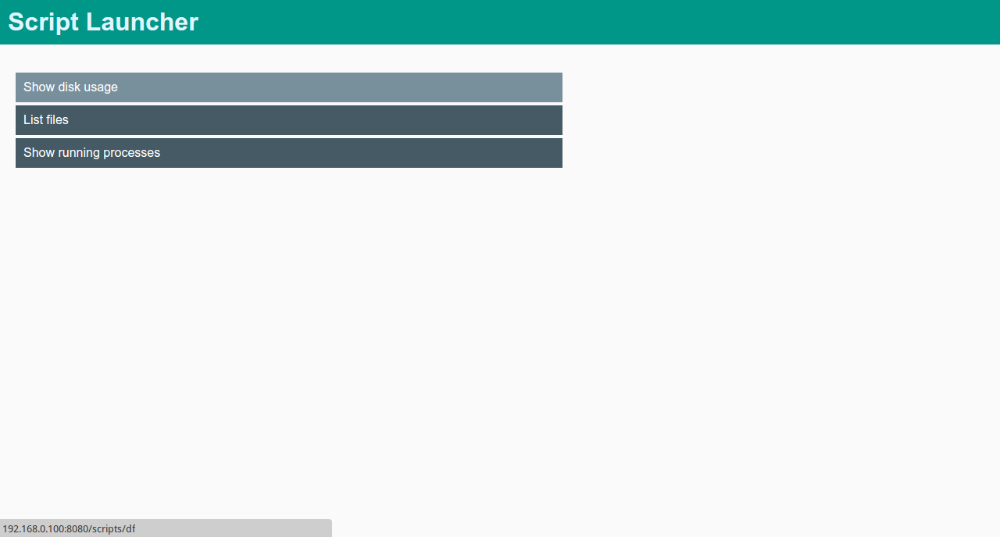
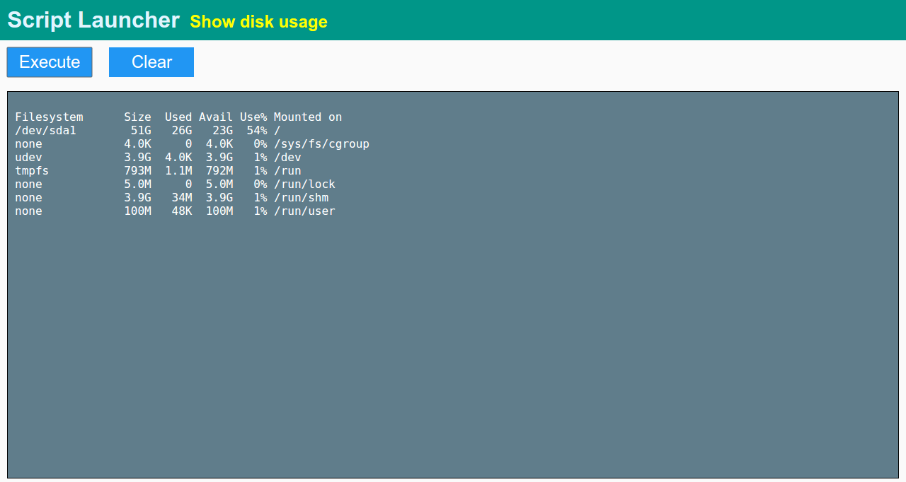

Launcher
========

Script launcher is web application that while running on some machine in the network will allow anyone who has access to it execute predefined scripts on different remote hosts using web interface. For example project manager or qa will be able to make deployments or check free disk space on server without developer involvment.

Screenshots
-----------





Configuration file:
-------------------
```toml
[hosts]

  [hosts.qa]
  name="192.168.10.10"
  user="aromanov"
  port=22

  [hosts.localhost]
  name="127.0.0.1"
  user="user"
  password="password"
  port=22

[scripts]
  
  [scripts.ls_qa]
  name="list files"
  host="qa"
  content="ls /data/"

  [scripts.df_qa]
  name="Available disk space on qa"
  host="qa"
  content="df -h"

  [scripts.docker_ps_qa]
  name="Running docker containers on qa"
  host="qa"
  content="sudo docker ps"

  [scripts.df_localhost]
  name="Available disk space on local server"
  host="localhost"
  content="df -h"
```

After you have installed `launcher`, you should create `launcher.toml` configuration file in folder where you will run it. Example of configuration file is shown above. There you specify hosts that will be used and scripts that will run on those hosts. If username is not specified for server, username of user that is running `launcher` will be used. If password is not specified, private key in `~/.ssh/` will be used for access to remote host.

Flags
-------

`launcher` binary has `-port` flag that will allow you to customize port web application will be running on (`8080` is default)

Output
------

Console output of script is shown on the page. Server sends script output through web socket, so end user can see output immediately and not only when script finishes.
